# Q-RAG3

Q-RAG3 é um poderoso sistema de Perguntas e Respostas construído sobre o modelo DeepSeek LLM 7B com capacidades RAG (Retrieval-Augmented Generation).

## Visão Geral do Dashboard


A plataforma Q-RAG3 fornece uma interface intuitiva com quatro componentes principais:

- **Pipeline RAG**: Construa e gerencie seu pipeline de processamento de documentos
- **Prompt Studio**: Projete e teste prompts para suas aplicações LLM
- **Workflows**: Crie fluxos de trabalho automatizados para processamento de documentos
- **Agentes**: Configure e implante agentes de IA

A plataforma é otimizada para operação eficiente com suporte a offloading em disco para o modelo DeepSeek LLM.

## Arquitetura do Sistema

### Diagrama de Componentes
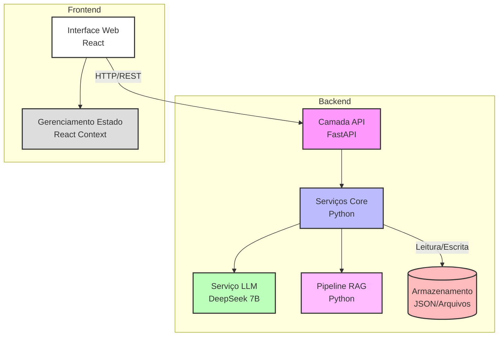

### Diagrama de Classes
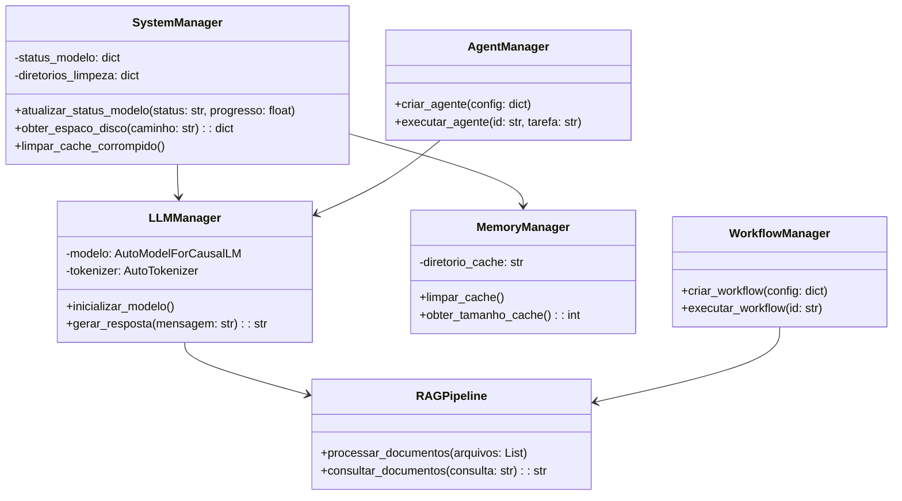

### Diagrama de Fluxo de Dados
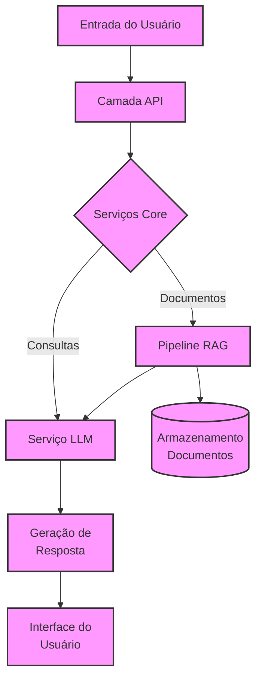

### Diagrama de Sequência da Aplicação
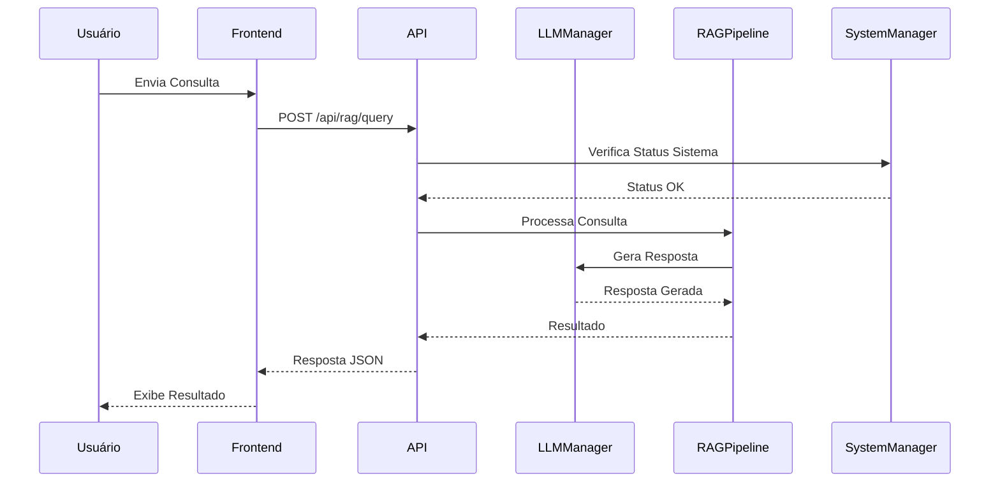

### Diagrama de Rotas da API
```mermaid
graph TB
    subgraph Endpoints
        H[/health/]:::health
        
        subgraph Dashboard
            D[/dashboard/stats/]:::dashboard
        end
        
        subgraph RAG
            R1[/rag/validate/]:::rag
            R2[/rag/upload/]:::rag
            R3[/rag/query/]:::rag
        end
        
        subgraph Sistema
            S1[/system/status/]:::system
            S2[/system/config/]:::system
            S3[/system/cache/cleanup/]:::system
        end
        
        subgraph Workflows
            W1[/workflows/]:::workflow
            W2[/workflows/{id}/]:::workflow
        end
        
        subgraph Prompts
            P1[/prompts/]:::prompt
            P2[/prompts/execute/]:::prompt
        end
        
        subgraph Agentes
            AG1[/agents/]:::agent
            AG2[/agents/{id}/]:::agent
            AG3[/agents/{id}/execute/]:::agent
        end
        
        subgraph Analytics
            AN1[/analytics/usage/]:::analytics
            AN2[/analytics/performance/]:::analytics
        end
    end
    
    classDef health fill:#97E49C,stroke:#333
    classDef dashboard fill:#FFB366,stroke:#333
    classDef rag fill:#FF99CC,stroke:#333
    classDef system fill:#99CCFF,stroke:#333
    classDef workflow fill:#CC99FF,stroke:#333
    classDef prompt fill:#FF99FF,stroke:#333
    classDef agent fill:#FFFF99,stroke:#333
    classDef analytics fill:#99FFCC,stroke:#333
```

### Diagrama de Otimização de Memória e Disco
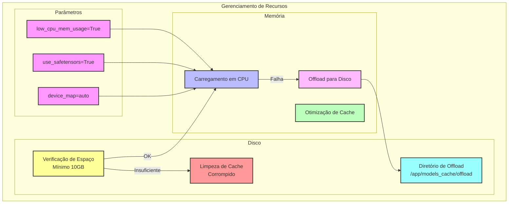

### Estrutura do app.py
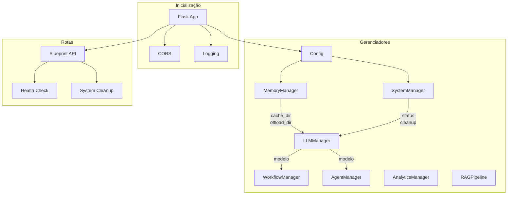

### Estratégia de Carregamento do Modelo
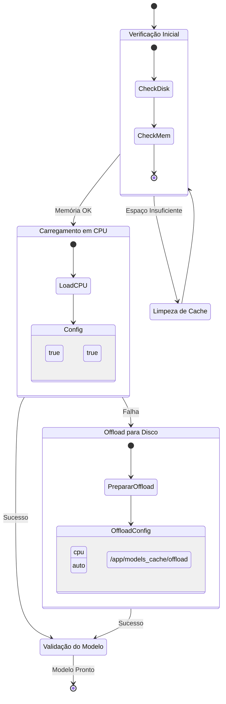

### Fluxo de Processamento RAG
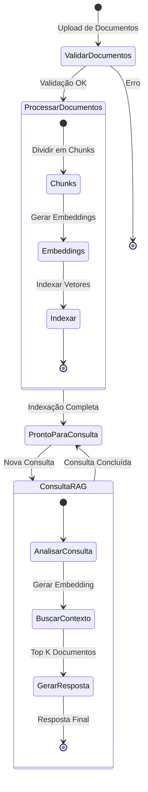

### Estrutura Docker e Volumes
```mermaid
graph TB
    subgraph Host
        subgraph Docker Container
            subgraph App[/app]
                MC[models_cache]:::cache
                UP[uploads]:::upload
                subgraph Cache[models_cache]
                    TR[transformers]:::transformers
                    HF[huggingface]:::huggingface
                    OF[offload]:::offload
                end
            end
        end

        subgraph Volumes Persistentes
            V1[models_cache]:::volume
            V2[uploads]:::volume
        end
    end

    V1 -.->|mount| MC
    V2 -.->|mount| UP
    
    classDef cache fill:#bbf,stroke:#333,stroke-width:2px
    classDef upload fill:#fbf,stroke:#333,stroke-width:2px
    classDef transformers fill:#bfb,stroke:#333,stroke-width:2px
    classDef huggingface fill:#ff9,stroke:#333,stroke-width:2px
    classDef offload fill:#f99,stroke:#333,stroke-width:2px
    classDef volume fill:#ddd,stroke:#333,stroke-width:2px

    %% Anotações
    style App fill:#fff,stroke:#333,stroke-width:2px
    style Docker Container fill:#f5f5f5,stroke:#666,stroke-width:2px
    style Host fill:#e9e9e9,stroke:#999,stroke-width:2px
```

### Tratamento de Erros e Recuperação
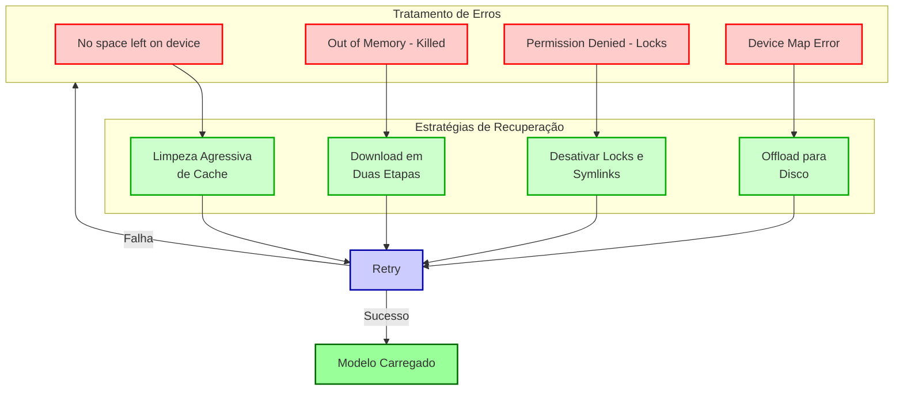

### Hierarquia de Componentes Frontend
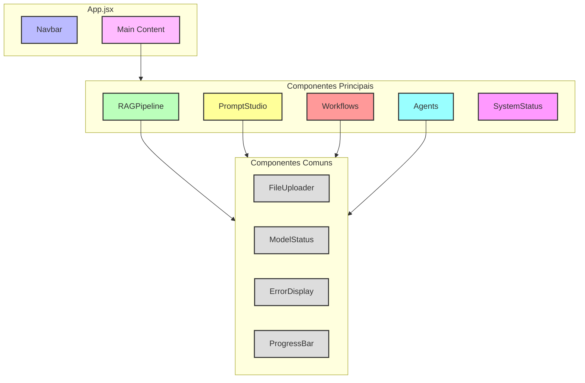

### Gerenciamento de Estado Frontend
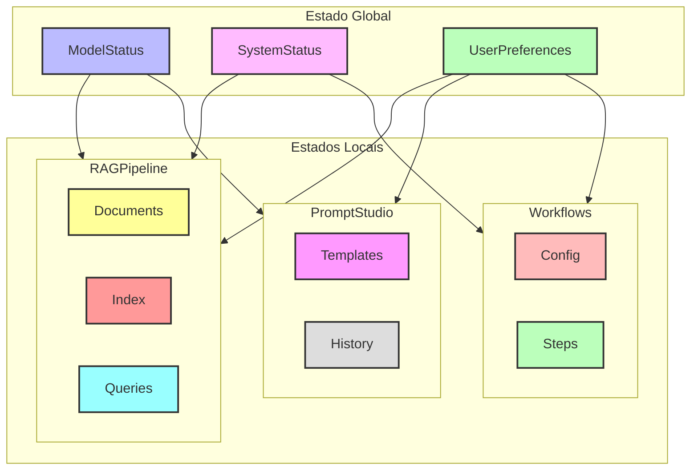

## Requisitos do Sistema

- Memória: Mínimo 512MB RAM (otimizado para ambientes com recursos limitados)
- Espaço em Disco: Mínimo 10GB de espaço livre
- Python 3.8+
- Node.js 14+

## Funcionalidades

- **Pipeline RAG**: Processe e consulte documentos usando técnicas RAG de última geração
- **Prompt Studio**: Crie, teste e gerencie prompts para diversos casos de uso
- **Gerenciamento de Workflows**: Construa e automatize fluxos complexos de processamento de documentos
- **Sistema de Agentes**: Crie agentes especializados para diferentes tarefas
- **Analytics**: Acompanhe o uso e desempenho do sistema
- **Otimizado para Baixos Recursos**: Funciona eficientemente em ambientes com memória limitada

## Documentação da API

### Dashboard
- `GET /api/dashboard/stats`
  - Retorna estatísticas gerais do sistema
  - Resposta inclui: status do sistema, status do modelo, contagem de workflows, contagem de agentes

### Workflows
- `GET /api/workflows`
  - Lista todos os workflows
- `POST /api/workflows`
  - Cria um novo workflow
- `GET /api/workflows/<id>`
  - Obtém detalhes do workflow
- `PUT /api/workflows/<id>`
  - Atualiza workflow
- `DELETE /api/workflows/<id>`
  - Remove workflow

### Prompt Studio
- `GET /api/prompts`
  - Lista prompts salvos
- `POST /api/prompts`
  - Salva um novo prompt
- `POST /api/prompts/execute`
  - Executa um prompt

### Pipeline RAG
- `POST /api/rag/upload`
  - Faz upload de documentos para processamento
- `POST /api/rag/query`
  - Consulta documentos processados

### Agentes
- `GET /api/agents`
  - Lista todos os agentes
- `POST /api/agents`
  - Cria um novo agente
- `GET /api/agents/<id>`
  - Obtém detalhes do agente
- `PUT /api/agents/<id>`
  - Atualiza agente
- `DELETE /api/agents/<id>`
  - Remove agente
- `POST /api/agents/<id>/execute`
  - Executa um agente

### Analytics
- `GET /api/analytics/usage`
  - Obtém estatísticas de uso
  - Parâmetros: start_date, end_date
- `GET /api/analytics/performance`
  - Obtém métricas de desempenho
  - Parâmetros: start_date, end_date

### Configurações
- `GET /api/system/config`
  - Obtém configurações do sistema
- `POST /api/system/config`
  - Atualiza configurações do sistema

### Status do Sistema
- `GET /api/system/status`
  - Obtém status atual do sistema
- `GET /api/models/status`
  - Obtém status do modelo
- `POST /api/system/cache/cleanup`
  - Limpa cache do sistema

## Gerenciamento de Memória

O sistema inclui várias otimizações para execução em ambientes com memória limitada:

1. **Carregamento do Modelo**:
   - Abordagem de carregamento em duas etapas
   - Primeira tentativa em CPU
   - Fallback para offload em disco se necessário

2. **Download do Modelo**:
   - Usa download otimizado via snapshot
   - Baixa apenas arquivos necessários
   - Valida integridade dos arquivos do modelo

3. **Offload de Pesos**:
   - Suporta offload de pesos do modelo para disco
   - Diretório de offload configurável
   - Limpeza automática do cache de offload

## Desenvolvimento

### Configuração do Backend
```bash
cd backend
python -m venv venv
source venv/bin/activate  # ou `venv\Scripts\activate` no Windows
pip install -r requirements.txt
python app.py
```

### Configuração do Frontend
```bash
cd frontend
npm install
npm start
```

## Suporte Docker

Construa e execute com Docker:

```bash
docker-compose up --build
```

## Contribuindo

1. Faça um fork do repositório
2. Crie sua branch de feature
3. Faça commit das suas alterações
4. Faça push para a branch
5. Crie um novo Pull Request

## Licença

Este projeto está licenciado sob a Licença MIT - veja o arquivo LICENSE para detalhes.
