# Q-RAG3

Q-RAG3 é um poderoso sistema de Perguntas e Respostas construído sobre o modelo DeepSeek LLM 7B com capacidades RAG (Retrieval-Augmented Generation).

## Visão Geral do Dashboard


A plataforma Q-RAG3 fornece uma interface intuitiva com quatro componentes principais:

- **Pipeline RAG**: Construa e gerencie seu pipeline de processamento de documentos
- **Prompt Studio**: Projete e teste prompts para suas aplicações LLM
- **Workflows**: Crie fluxos de trabalho automatizados para processamento de documentos
- **Agentes**: Configure e implante agentes de IA

A plataforma é otimizada para operação eficiente com suporte a offloading em disco para o modelo DeepSeek LLM.

## Arquitetura do Sistema

### Diagrama de Componentes
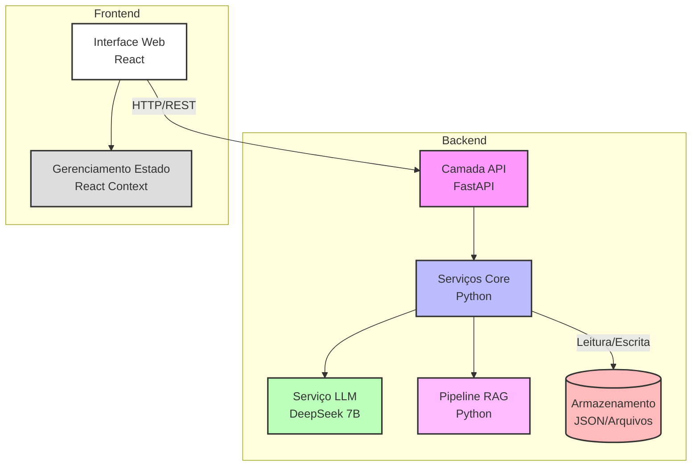

### Diagrama de Classes
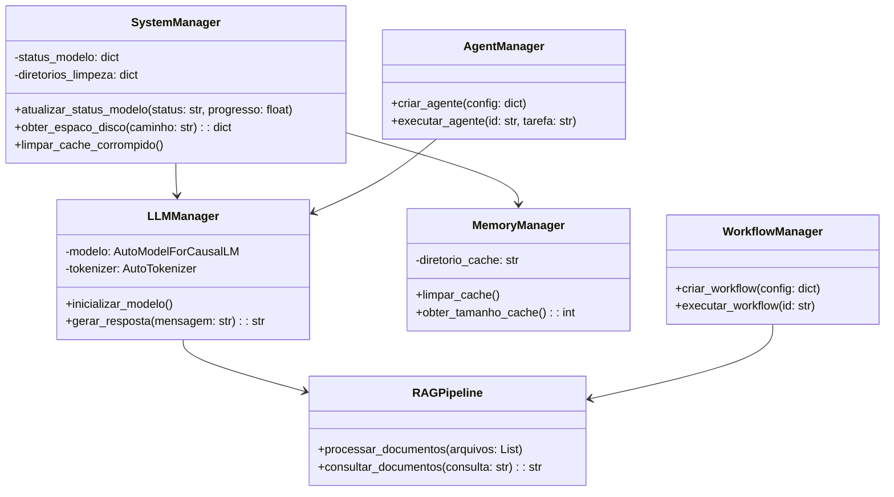

### Diagrama de Fluxo de Dados
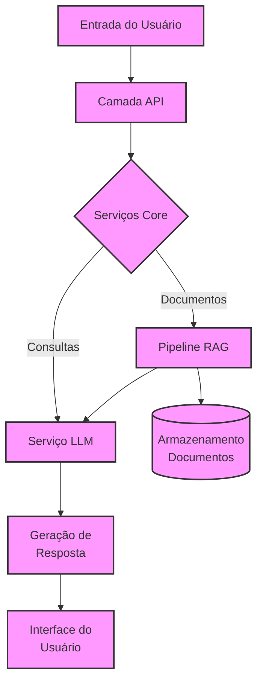

### Diagrama de Sequência da Aplicação
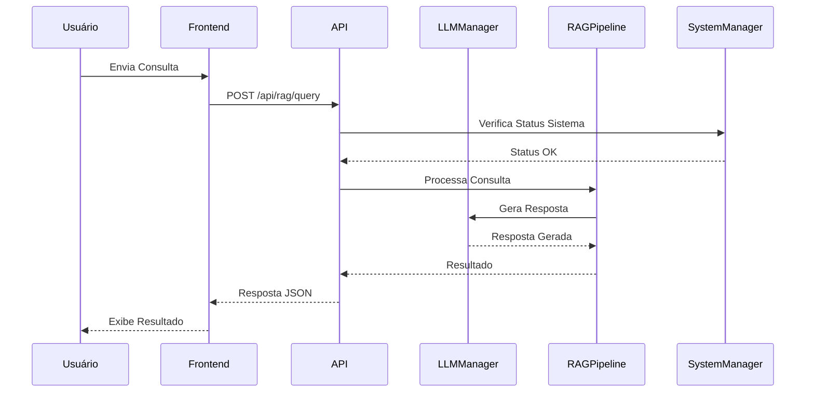

### Diagrama de Rotas da API
```mermaid
graph TB
    subgraph API[Endpoints da API]
        subgraph Sistema[Sistema]
            subgraph ModelManagement[Gerenciamento do Modelo]
                %% Carregamento em duas etapas
                M1[/model/load/cpu/]:::memory
                M2[/model/load/offload/]:::memory
                M3[/model/status/]:::memory
                M1 --> M2: Fallback
                M2 --> M3: Status

                %% Configurações de Otimização
                M4[/model/config/memory/]:::memory
                M5[/model/config/offload/]:::memory
                M4 --> M1
                M4 --> M2
            end

            subgraph CacheManagement[Gerenciamento de Cache]
                %% Verificação e Limpeza
                C1[/cache/verify/space/]:::cache
                C2[/cache/cleanup/corrupted/]:::cache
                C3[/cache/cleanup/offload/]:::cache
                C1 --> C2 --> C3
            end

            subgraph Recovery[Recuperação]
                %% Download e Verificação
                R1[/recovery/download/]:::recovery
                R2[/recovery/verify/]:::recovery
                R3[/recovery/repair/]:::recovery
                R1 --> R2 --> R3
            end
        end

        subgraph Core[Core]
            %% Pipeline RAG
            RAG1[/rag/validate/]:::rag
            RAG2[/rag/upload/]:::rag
            RAG3[/rag/query/]:::rag
            RAG1 --> RAG2 --> RAG3

            %% Workflows
            W1[/workflows/]:::workflow
            W2[/workflows/{id}/execute/]:::workflow
            W1 --> W2

            %% Prompts
            P1[/prompts/]:::prompt
            P2[/prompts/execute/]:::prompt
            P1 --> P2

            %% Agentes
            A1[/agents/]:::agent
            A2[/agents/{id}/execute/]:::agent
            A1 --> A2
        end

        subgraph Monitor[Monitoramento]
            %% Status e Analytics
            ST1[/system/status/]:::system
            ST2[/system/metrics/]:::system
            ST3[/system/health/]:::system
            ST1 --> ST2 --> ST3
        end
    end

    %% Fluxos Principais
    ModelManagement --> Core: Modelo Carregado
    CacheManagement --> ModelManagement: Otimização
    Recovery --> ModelManagement: Recuperação

    %% Fluxos de Monitoramento
    ModelManagement --> Monitor: Status
    CacheManagement --> Monitor: Métricas
    Core --> Monitor: Saúde

    %% Fluxos de Execução
    W1 --> RAG2: Processamento
    P2 --> RAG3: Consulta
    A2 --> P2: Execução

    classDef memory fill:#FFE4B5,stroke:#8B4513,stroke-width:2px
    classDef cache fill:#B0E0E6,stroke:#4682B4,stroke-width:2px
    classDef recovery fill:#FFA07A,stroke:#8B0000,stroke-width:2px
    classDef rag fill:#DDA0DD,stroke:#8B008B,stroke-width:2px
    classDef workflow fill:#FFB6C1,stroke:#FF69B4,stroke-width:2px
    classDef prompt fill:#E6E6FA,stroke:#483D8B,stroke-width:2px
    classDef agent fill:#F08080,stroke:#CD5C5C,stroke-width:2px
    classDef system fill:#98FB98,stroke:#006400,stroke-width:2px

    style API fill:#f5f5f5,stroke:#333,stroke-width:2px
    style Sistema fill:#f8f8f8,stroke:#666,stroke-width:1px
    style Core fill:#f0f0f0,stroke:#666,stroke-width:1px
    style Monitor fill:#f0f8ff,stroke:#666,stroke-width:1px
```

### Variáveis de Ambiente

O sistema utiliza as seguintes variáveis de ambiente para otimizar o carregamento do modelo:

```bash
# Desativa avisos e locks
HF_HUB_DISABLE_SYMLINKS_WARNING=1
HF_HUB_DISABLE_EXPERIMENTAL_WARNING=1
HF_HUB_DISABLE_IMPLICIT_TOKEN=1
DISABLE_TELEMETRY=1

# Configurações de Otimização
LOW_CPU_MEM_USAGE=true
USE_SAFETENSORS=true
DEVICE_MAP=auto
```

Estas variáveis são essenciais para:
1. Contornar problemas de permissão com arquivos de lock
2. Otimizar o uso de memória durante o carregamento do modelo
3. Configurar o offload automático quando necessário

    classDef health fill:#98FB98,stroke:#006400,stroke-width:2px
    classDef memory fill:#FFE4B5,stroke:#8B4513,stroke-width:2px
    classDef cache fill:#B0E0E6,stroke:#4682B4,stroke-width:2px
    classDef system fill:#F0E68C,stroke:#DAA520,stroke-width:2px
    classDef rag fill:#DDA0DD,stroke:#8B008B,stroke-width:2px
    classDef workflow fill:#FFB6C1,stroke:#FF69B4,stroke-width:2px
    classDef prompt fill:#E6E6FA,stroke:#483D8B,stroke-width:2px
    classDef agent fill:#F08080,stroke:#CD5C5C,stroke-width:2px
    classDef analytics fill:#98D8C8,stroke:#2F4F4F,stroke-width:2px
    classDef recovery fill:#FFA07A,stroke:#8B0000,stroke-width:2px

    style API fill:#f5f5f5,stroke:#333,stroke-width:2px
    style Sistema fill:#f8f8f8,stroke:#666,stroke-width:1px

    subgraph Dashboard[Dashboard]
        subgraph ModelStatus[Status do Modelo]
            D1[/dashboard/model/status/]:::dashboard
            D2[/dashboard/model/memory/]:::dashboard
            D3[/dashboard/model/disk/]:::dashboard
            D1 --> D2
            D2 --> D3
        end

        subgraph SystemStats[Estatísticas]
            D4[/dashboard/stats/system/]:::dashboard
            D5[/dashboard/stats/cache/]:::dashboard
            D6[/dashboard/stats/performance/]:::dashboard
        end
    end

    %% Conexões do Dashboard com Sistema
    ModelStatus --> Memory: Monitoramento
    ModelStatus --> Cache: Verificação
    SystemStats --> Status: Métricas
    SystemStats --> Analytics: Desempenho

    classDef dashboard fill:#87CEEB,stroke:#4682B4,stroke-width:2px
```

### Diagrama de Otimização de Memória e Disco
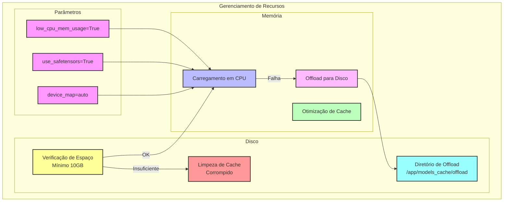

### Estrutura do app.py
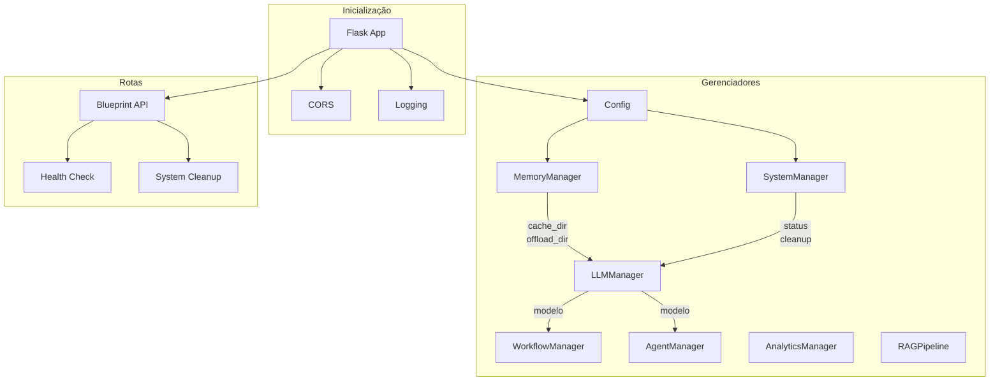

### Estratégia de Carregamento do Modelo
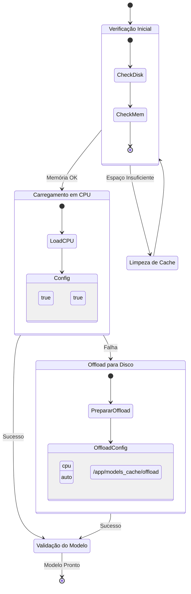

### Fluxo de Processamento RAG
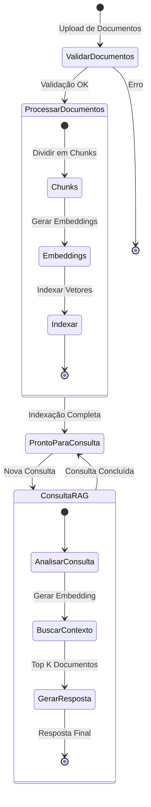

### Estrutura Docker e Volumes
```mermaid
graph TB
    subgraph Host
        subgraph Docker Container
            subgraph App[/app]
                MC[models_cache]:::cache
                UP[uploads]:::upload
                subgraph Cache[models_cache]
                    TR[transformers]:::transformers
                    HF[huggingface]:::huggingface
                    OF[offload]:::offload
                end
            end
        end

        subgraph Volumes Persistentes
            V1[models_cache]:::volume
            V2[uploads]:::volume
        end
    end

    V1 -.->|mount| MC
    V2 -.->|mount| UP
    
    classDef cache fill:#bbf,stroke:#333,stroke-width:2px
    classDef upload fill:#fbf,stroke:#333,stroke-width:2px
    classDef transformers fill:#bfb,stroke:#333,stroke-width:2px
    classDef huggingface fill:#ff9,stroke:#333,stroke-width:2px
    classDef offload fill:#f99,stroke:#333,stroke-width:2px
    classDef volume fill:#ddd,stroke:#333,stroke-width:2px

    %% Anotações
    style App fill:#fff,stroke:#333,stroke-width:2px
    style Docker Container fill:#f5f5f5,stroke:#666,stroke-width:2px
    style Host fill:#e9e9e9,stroke:#999,stroke-width:2px
```

### Tratamento de Erros e Recuperação
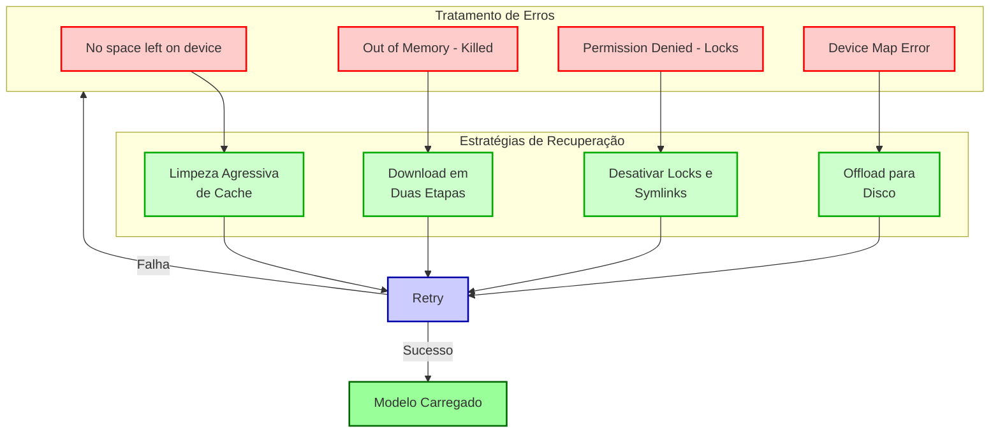

### Hierarquia de Componentes Frontend
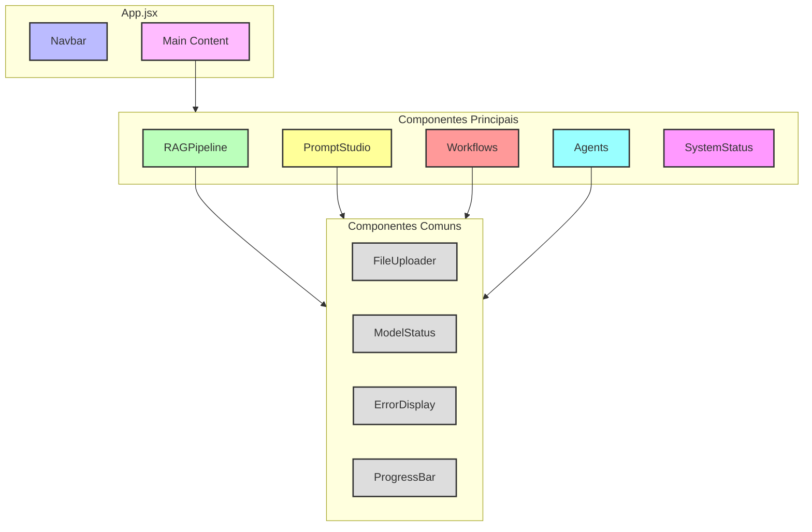

### Gerenciamento de Estado Frontend
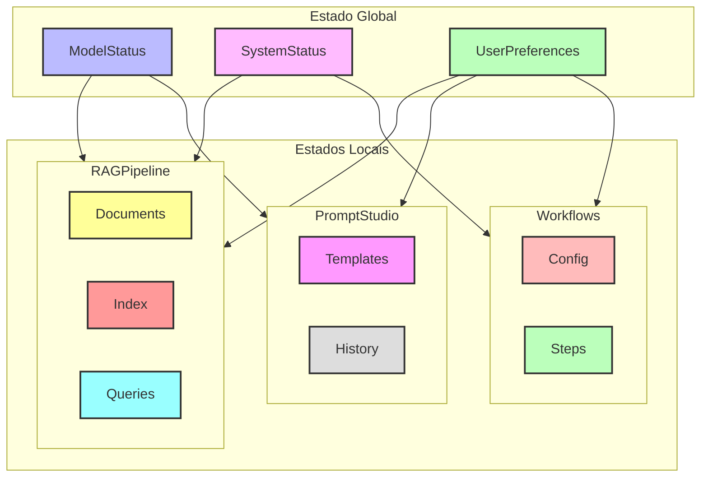

## Requisitos do Sistema

- Memória: Mínimo 512MB RAM (otimizado para ambientes com recursos limitados)
- Espaço em Disco: Mínimo 10GB de espaço livre
- Python 3.8+
- Node.js 14+

## Funcionalidades

- **Pipeline RAG**: Processe e consulte documentos usando técnicas RAG de última geração
- **Prompt Studio**: Crie, teste e gerencie prompts para diversos casos de uso
- **Gerenciamento de Workflows**: Construa e automatize fluxos complexos de processamento de documentos
- **Sistema de Agentes**: Crie agentes especializados para diferentes tarefas
- **Analytics**: Acompanhe o uso e desempenho do sistema
- **Otimizado para Baixos Recursos**: Funciona eficientemente em ambientes com memória limitada

## Documentação da API

### Dashboard
- `GET /api/dashboard/stats`
  - Retorna estatísticas gerais do sistema
  - Resposta inclui: status do sistema, status do modelo, contagem de workflows, contagem de agentes

### Workflows
- `GET /api/workflows`
  - Lista todos os workflows
- `POST /api/workflows`
  - Cria um novo workflow
- `GET /api/workflows/<id>`
  - Obtém detalhes do workflow
- `PUT /api/workflows/<id>`
  - Atualiza workflow
- `DELETE /api/workflows/<id>`
  - Remove workflow

### Prompt Studio
- `GET /api/prompts`
  - Lista prompts salvos
- `POST /api/prompts`
  - Salva um novo prompt
- `POST /api/prompts/execute`
  - Executa um prompt

### Pipeline RAG
- `POST /api/rag/upload`
  - Faz upload de documentos para processamento
- `POST /api/rag/query`
  - Consulta documentos processados

### Agentes
- `GET /api/agents`
  - Lista todos os agentes
- `POST /api/agents`
  - Cria um novo agente
- `GET /api/agents/<id>`
  - Obtém detalhes do agente
- `PUT /api/agents/<id>`
  - Atualiza agente
- `DELETE /api/agents/<id>`
  - Remove agente
- `POST /api/agents/<id>/execute`
  - Executa um agente

### Analytics
- `GET /api/analytics/usage`
  - Obtém estatísticas de uso
  - Parâmetros: start_date, end_date
- `GET /api/analytics/performance`
  - Obtém métricas de desempenho
  - Parâmetros: start_date, end_date

### Configurações
- `GET /api/system/config`
  - Obtém configurações do sistema
- `POST /api/system/config`
  - Atualiza configurações do sistema

### Status do Sistema
- `GET /api/system/status`
  - Obtém status atual do sistema
- `GET /api/models/status`
  - Obtém status do modelo
- `POST /api/system/cache/cleanup`
  - Limpa cache do sistema

## Gerenciamento de Memória

O sistema inclui várias otimizações para execução em ambientes com memória limitada:

1. **Carregamento do Modelo**:
   - Abordagem de carregamento em duas etapas
   - Primeira tentativa em CPU
   - Fallback para offload em disco se necessário

2. **Download do Modelo**:
   - Usa download otimizado via snapshot
   - Baixa apenas arquivos necessários
   - Valida integridade dos arquivos do modelo

3. **Offload de Pesos**:
   - Suporta offload de pesos do modelo para disco
   - Diretório de offload configurável
   - Limpeza automática do cache de offload

## Desenvolvimento

### Configuração do Backend
```bash
cd backend
python -m venv venv
source venv/bin/activate  # ou `venv\Scripts\activate` no Windows
pip install -r requirements.txt
python app.py
```

### Configuração do Frontend
```bash
cd frontend
npm install
npm start
```

## Suporte Docker

Construa e execute com Docker:

```bash
docker-compose up --build
```

## Contribuindo

1. Faça um fork do repositório
2. Crie sua branch de feature
3. Faça commit das suas alterações
4. Faça push para a branch
5. Crie um novo Pull Request

## Licença

Este projeto está licenciado sob a Licença MIT - veja o arquivo LICENSE para detalhes.
